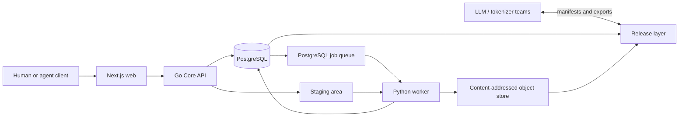

# Derlem

**A Turkish-centered, model-independent and auditable AI data workshop.**

[Türkçe](README.md) | [English](README.en.md)

[](https://github.com/celikbros/derlem/actions/workflows/ci.yml)

Derlem registers raw sources, streams files into content-addressed immutable
storage, runs automated quality gates, records human review, and produces
reproducible frozen dataset releases for LLM and tokenizer teams.

It does not train models and does not modify tokenizer code. Training teams
consume approved, versioned Derlem exports through their own model adapters.

> **Status:** Active MVP development. The source catalog, JWT authorization,
> streaming browser uploads, content-addressed storage, PostgreSQL job queue,
> baseline PII scanning, SHA256 exact-duplicate gate, bounded document
> sampling, immutable document versions, scored document moderation, exact
> pretrain decontamination, frozen manifest/artifact downloads, and append-only
> audit are operational.

## Contents

- [Why Derlem?](#why-derlem)
- [Scope](#scope)
- [Design Principles](#design-principles)
- [Architecture](#architecture)
- [Data Lifecycle](#data-lifecycle)
- [Quality and Safety Gates](#quality-and-safety-gates)
- [Model-Independent Data](#model-independent-data)
- [Technology Choices](#technology-choices)
- [Repository Layout](#repository-layout)
- [Local Setup](#local-setup)
- [API Summary](#api-summary)
- [Tests](#tests)
- [Scaling Strategy](#scaling-strategy)
- [Roadmap](#roadmap)
- [Documentation](#documentation)
- [Security and License](#security-and-license)

## Why Derlem?

Model teams need more than text volume. They need data with known provenance,
recorded rights, sensitive-data checks, duplicate controls, review history,
and reproducible release inputs.

Derlem is designed to address:

- Uncontrolled copies of corpus files across unrelated directories.
- Lost license, source, checksum, and processing history.
- Eval or holdout content leaking into training pools.
- PII or duplicate findings silently entering a release.
- Model-specific chat templates becoming the canonical data format.
- Dataset releases that cannot be reproduced from the same inputs.
- Human and automated decisions that leave no auditable record.

The first seed is the existing Turkish corpus under `C:\CELIK-GARDASH`. This
local path is provenance only; a source is not approved until its file is
copied into immutable storage.

For the current Gardas/Faz 2 seed import record, see [Gardas Seed Import](docs/gardash_seed_import.md).

## Scope

### What Derlem does

- Records source metadata, rights status, license evidence, and lineage.
- Accepts streamed TXT, JSONL, JSON, CSV, and TSV browser uploads.
- Stores files under a SHA256 identity in content-addressed immutable storage.
- Calculates file size, line count, encoding status, and checksum.
- Scans for TCKN, IBAN, email, phone, and payment-card patterns.
- Detects exact source-artifact duplicates using byte-level SHA256.
- Enforces role-based review, rejection reasons, and self-review prevention.
- Appends every important decision to an immutable audit trail.
- Exposes approved data as frozen releases, SHA256 manifests, and downloadable artifacts.

### What Derlem does not do

- Run LLM or tokenizer training.
- Make final legal or model-quality claims by itself.
- Store large text blobs inside PostgreSQL.
- Treat any model's chat template as the canonical data schema.
- Auto-approve data with unknown or blocked rights.
- Modify an existing frozen release in place; corrections create a new release.

## Design Principles

1. **Canonical data is model-independent.** GLM, DeepSeek, Kimi, and other
   templates belong to a derived export layer.
2. **A file is identified by SHA256, not by path.** The original path is
   lineage metadata only.
3. **Rights are default-deny.** `unknown`, `restricted`, and `blocked` sources
   cannot be approved.
4. **Training purpose is fixed at registration.** `content_purpose` is required
   and protected by a database trigger.
5. **Audit is append-only.** Database triggers reject update, delete, and
   truncate operations.
6. **Humans and agents share one authorization model.** Critical rights and
   freeze decisions remain human gates.
7. **Frozen releases are immutable.** Source identities and checksums are
   snapshotted at freeze time.
8. **Scale follows measurement.** The MVP uses PostgreSQL and local storage;
   S3/MinIO and dedicated messaging are introduced when evidence requires them.

## Architecture



### Request path

The Go API handles authentication, role checks, source CRUD, optimistic
locking, upload streaming, review decisions, and audit writes. It is stateless
so multiple API instances can be placed behind a load balancer.

### Metadata and work queue

PostgreSQL stores users, roles, source metadata, quality states, reviews,
release records, audit events, and background jobs. Workers claim jobs safely
with `FOR UPDATE SKIP LOCKED`.

### File storage

Large raw and processed files are not database blobs. The MVP uses a local
filesystem behind a storage interface:

```text
var/storage/objects/sha256/aa/bb/<64-character-sha256>
```

The same interface can later be implemented for S3 or MinIO.

### Data processing

The Python worker performs immutable ingest, encoding validation, line counts,
PII scans, source-artifact exact-duplicate checks, normalized document exact
dedup, deterministic reservoir document sampling, release freeze, and exact
pretrain decontamination. Future DuckDB/Polars jobs will add sharding, full
document indexing, and consolidated export generation.

## Data Lifecycle

```text
source_registered
  -> browser upload or trusted local ingest
  -> immutable SHA256 object
  -> raw_ingested
  -> scan_pii + check_exact_duplicate
  -> index_document_fingerprints
  -> sample_documents
  -> auto_checked | quarantined
  -> human review
  -> approved_source | rejected | sensitive_review
  -> release_candidate
  -> frozen release
```

1. A user creates a source with all required metadata.
2. The browser streams the file to staging without buffering it in memory.
3. The worker calculates SHA256, byte size, line count, and UTF-8 status.
4. The object is atomically placed under its SHA256 storage key.
5. PII and exact-duplicate checks run as independent background jobs.
6. The canonical source is indexed with normalized document fingerprints.
7. Bounded deterministic document samples are extracted only after document
   exact-dedup is clear.
8. Sample content is immutable object data; version metadata stays in PostgreSQL.
9. An authorized reviewer can decide only after all mandatory gates pass.
10. The Release Builder selects approved sources of one purpose, snapshots each
   source version and SHA256, and reruns mandatory gates.
11. The freeze job creates a deterministic manifest and exposes the manifest
    and frozen source artifacts as read-only consumer downloads.

## Quality and Safety Gates

A source can become `approved_source` only when:

| Gate | Required result | Purpose |
| --- | --- | --- |
| Immutable ingest | `object_sha256` exists | Prevent the reviewed artifact from changing |
| Rights | `rights_status=cleared` | Reject uncertain or blocked data |
| License evidence | `license_evidence_ref` exists | Preserve the basis for the rights decision |
| PII scan | `pii_status=clear` | Prevent sensitive data from silently passing |
| Exact duplicate | `duplicate_status=unique` | Prevent the same artifact from being approved twice |
| Normalized document dedup | `normalized_dedup_status=unique` | Prevent repeated text with different whitespace/case from being approved |
| Document samples | Every sample is approved at its current version | Keep source decisions from relying on unreviewed content |
| Human decision | Authorized reviewer | Keep critical approval outside automation alone |

Duplicate control now has two layers: `duplicate_status` detects byte-identical
source files using SHA256, while `normalized_dedup_status` indexes document-level
SHA256 fingerprints after NFKC normalization, casefolding, and whitespace
collapse. The fingerprint table stores hashes, ordinals, and counts only; it
does not store raw text. MinHash/SimHash near-dedup and n-gram overlap are
later-phase work.

PII scans never store raw matched values; they store only category counts and
status. Checks include valid TCKN checksum, IBAN mod-97, and Luhn-valid payment
cards.

A pretrain freeze compares document text against registered `eval` and
`holdout` sources using exact SHA256 matches. The hash index lives in a
temporary SQLite file; any match or document beyond `MAX_DOCUMENT_BYTES`
blocks the freeze. This gate does not claim near-duplicate or semantic coverage.

## Model-Independent Data

Prompts sent to an LLM are often structured conversations with roles, tool
calls, multimodal parts, special tokens, and a model-specific chat template.
Derlem therefore does not design its database around one model's template.

Canonical concepts include:

- `conversation_sample`: a task or conversation sample.
- `message`: a `system`, `user`, `assistant`, or `tool` turn.
- `message_part`: text, image, audio, video, or tool reference.
- `tool_definition`, `tool_call`, `tool_result`: tool contract and execution.
- `export_profile`: a standard output contract satisfied by a sample.
- `model_adapter`: rendering rules for a model family.
- `prompt_rendering`: a derived artifact produced by an adapter.

When a new model appears, samples are not individually re-approved. The model
team converts the canonical export with its own adapter. Persisted rendered
prompts belong in immutable object storage, not as large database blobs.

## Technology Choices

| Layer | Technology | Rationale |
| --- | --- | --- |
| Core API | Go 1.25+ | Low memory use, strong concurrency, simple deployment, high request capacity |
| Metadata DB | PostgreSQL 17+ | Transactions, constraints, JSONB, audit, and reliable queue semantics |
| Worker | Python 3.12+ | Strong data-processing, PII, and future NLP ecosystem |
| Web | Next.js 16, React 19, TypeScript | Type-safe operations UI and server-side API proxy |
| Object storage | Local content-addressed store | Low MVP overhead behind an S3/MinIO-ready interface |
| Job queue | PostgreSQL `SKIP LOCKED` | Reliable MVP without another service; Redis/NATS/Kafka when measured |
| Auth | JWT and RBAC | Real identity from day one; Keycloak/OAuth later |
| CI | GitHub Actions | Repeat Go, Python, and web checks on every push and PR |

Go was chosen over Rust deliberately. Derlem's hot path is networking,
authorization, metadata, and file streaming. Go provides sufficient
performance with lower implementation and maintenance cost. A measured,
CPU-heavy component can still be implemented independently in Rust later.

## Repository Layout

```text
cmd/api/                         Go API entry point
cmd/migrate/                     PostgreSQL migration command
internal/auth/                   Password, JWT, bootstrap admin
internal/database/               Connection and ordered SQL migrations
internal/domain/                 API/domain types
internal/httpapi/                Routes, middleware, and handlers
internal/repository/             Transactions and queries
internal/storage/                Content-addressed storage interface
worker/src/derlem_worker/        Python background worker
worker/tests/                    Worker unit tests
web/app/                         Next.js App Router and API proxy
web/components/                  Operations UI components
web/tests/e2e/                   Playwright scenarios
schemas/                         Model-independent JSON Schema contracts
data_samples/                    Small, safe sample records
docs/                            Architecture, governance, and advisor documents
```

## Local Setup

### Requirements

- Go 1.25+
- PostgreSQL 17+
- Python 3.12+
- Node.js 22+

Docker, Redis, and MinIO are not required for the local MVP.

### 1. Configuration

```powershell
Copy-Item .env.example .env
Copy-Item web/.env.local.example web/.env.local
```

Set a local `DATABASE_URL`, a strong `JWT_SECRET`, and bootstrap admin
credentials. Never commit real secrets.

| Variable | Purpose |
| --- | --- |
| `DATABASE_URL` | PostgreSQL connection string |
| `JWT_SECRET` | Token signing key with at least 32 characters |
| `BOOTSTRAP_ADMIN_EMAIL` | Initial administrator account |
| `BOOTSTRAP_ADMIN_PASSWORD` | Initial administrator password |
| `STORAGE_ROOT` | Immutable object-store root |
| `STAGING_ROOT` | Temporary streamed-upload area |
| `MAX_UPLOAD_BYTES` | Per-upload limit; defaults to 50 GiB |
| `WORKER_POLL_INTERVAL` | Worker queue polling interval |
| `DOCUMENT_SAMPLE_SIZE` | Bounded review samples per source; defaults to 200 |
| `MAX_DOCUMENT_BYTES` | Sampling/decontamination document limit; defaults to 256 KiB |
| `NEXT_PUBLIC_LOCAL_LOGIN_EMAIL` | Account displayed only on the local login card |
| `NEXT_PUBLIC_LOCAL_LOGIN_PASSWORD` | Password displayed only on the local login card |

`NEXT_PUBLIC_LOCAL_LOGIN_*` values are visible in the browser bundle. Use them
only in the ignored `web/.env.local` file and in local development.

### 2. Dependencies and migrations

```powershell
go mod download
go run ./cmd/migrate

python -m venv .venv
.\.venv\Scripts\python.exe -m pip install -e ".\worker[dev]"

Set-Location web
npm ci
Set-Location ..
```

### 3. Run services

Open three terminals:

```powershell
go run ./cmd/api
```

```powershell
.\.venv\Scripts\python.exe -m derlem_worker --worker-id local-worker
```

```powershell
Set-Location web
npm run dev
```

- Web: `http://localhost:3000`
- API: `http://localhost:8080`
- Liveness: `http://localhost:8080/health/live`
- Readiness: `http://localhost:8080/health/ready`

See [docs/local_development.md](docs/local_development.md) for details.

## API Summary

| Method | Endpoint | Purpose |
| --- | --- | --- |
| `POST` | `/api/v1/auth/login` | Open a JWT session |
| `GET` | `/api/v1/me` | Return the active user and roles |
| `GET/POST` | `/api/v1/sources` | List or create sources |
| `GET/PATCH` | `/api/v1/sources/{id}` | Source detail and optimistic update |
| `POST` | `/api/v1/sources/{id}/upload` | Stream a browser upload |
| `POST` | `/api/v1/sources/{id}/ingest` | Trusted local-path ingest |
| `GET/POST` | `/api/v1/sources/{id}/reviews` | Review history and decision |
| `GET` | `/api/v1/sources/{id}/pii-scans` | PII scan results |
| `GET` | `/api/v1/sources/{id}/documents` | Bounded document samples |
| `GET/PATCH` | `/api/v1/documents/{id}` | Read immutable content or create a version |
| `GET/POST` | `/api/v1/documents/{id}/reviews` | Document quality score and moderation history |
| `GET` | `/api/v1/jobs` | Background job status |
| `GET/POST` | `/api/v1/releases` | List releases or create a draft from approved sources |
| `GET` | `/api/v1/releases/{id}` | Release, source snapshots, and gate results |
| `POST` | `/api/v1/releases/{id}/freeze` | Queue an admin-controlled freeze job |
| `POST` | `/api/v1/releases/{id}/exports` | Queue a deterministic JSONL/TXT export for a frozen release |
| `GET` | `/api/v1/releases/{id}/manifest` | Download a frozen manifest |
| `GET` | `/api/v1/releases/{id}/exports/{format}/artifact` | Download a ready canonical export |
| `GET` | `/api/v1/releases/{id}/exports/{format}/manifest` | Download an export manifest |
| `GET` | `/api/v1/releases/{id}/sources/{source_id}/artifact` | Download a frozen source artifact |

Lists use cursor pagination. Metadata updates require the current `version` and
return `409 version_conflict` if another writer changed the record first.

## Tests

```powershell
go test ./...

$env:TEMP='C:\tmp'
$env:TMP='C:\tmp'
.\.venv\Scripts\python.exe -m pytest worker\tests

Set-Location web
npm run lint
npm run build
npm audit --audit-level=moderate
```

Playwright requires running API/web services and a local E2E account:

```powershell
$env:E2E_EMAIL='admin@derlem.local'
$env:E2E_PASSWORD='your-local-password'
npm run test:e2e
```

A short-lived local JWT may be supplied through `E2E_TOKEN` instead of a password.

The mutating upload scenario also requires explicit `E2E_MUTATING=1`.

## Scaling Strategy

Supporting millions of users is not solved by a programming language alone.
Derlem preserves these scaling boundaries:

- The API is stateless and can run as multiple Go instances.
- Large uploads are streamed instead of buffered in API memory.
- File data lives in object storage rather than the metadata database.
- Job consumers scale horizontally with `SKIP LOCKED`.
- Cursor pagination avoids large offset scans.
- Optimistic locking prevents lost concurrent edits.
- The storage interface isolates migration from local disk to S3/MinIO.
- Redis Streams, NATS, or Kafka can be evaluated under measured queue pressure.

Kubernetes and microservices are not MVP prerequisites. The system is measured
on one machine first and split only around demonstrated bottlenecks.

## Roadmap

For detailed version targets, see [Derlem Version Roadmap](docs/version_roadmap.md).
In short: **v0.1 Core MVP is complete; v0.2 Large Corpus Ingest and Full
Document Index is the next active target.**

### Operational slice

- [x] Go API, JWT authentication, and RBAC
- [x] PostgreSQL migrations and append-only audit
- [x] Source catalog, cursor pagination, and optimistic locking
- [x] Streaming browser upload and trusted local ingest
- [x] Content-addressed immutable storage
- [x] PostgreSQL background job queue
- [x] TCKN/IBAN/card/phone/email PII scanning
- [x] Source-artifact SHA256 exact-duplicate gate
- [x] Normalized document exact-dedup fingerprint gate
- [x] Deterministic bounded document sampling
- [x] Deterministic model-independent JSONL/TXT exports from frozen releases
- [x] Export artifact/manifest checksums, progress reporting, and role-gated downloads
- [x] Object-store-backed immutable document versions and editor dialog
- [x] Document quality scores, immutable review history, and full-sample gate
- [x] Moderation, rejection reasons, and self-review prevention
- [x] Draft/frozen Release Builder for approved sources of one purpose
- [x] Deterministic manifest, source-version snapshot, and SHA256 snapshot
- [x] Exact pretrain document decontamination against eval/holdout
- [x] Frozen manifest and source-artifact downloads
- [x] Next.js operations UI
- [x] GitHub Actions CI

### Next

- [ ] Full-corpus document indexing and bulk review workflow
- [ ] Multidimensional quality scores and risk-based sampling
- [ ] Multi-shard/Parquet packaging and token estimates
- [ ] Near-dedup and approximate decontamination
- [ ] S3/MinIO storage implementation
- [ ] Keycloak/OAuth and service accounts

## Documentation

- [MVP plan](docs/web_data_atolyesi_mvp_plan.md)
- [Version roadmap](docs/version_roadmap.md)
- [Project completion status](docs/project_completion_status.md)
- [Local development](docs/local_development.md)
- [Local role test users](docs/local_role_testing.md)
- [Production deployment](docs/production_deployment.md)
- [API and workflows](docs/api_workflows.md)
- [Canonical export contract](docs/canonical_exports.en.md)
- [Pretraining data factory](docs/pretraining_data_factory.md)
- [Model prompt format abstraction](docs/model_prompt_format_abstraction.md)
- [Scalability architecture](docs/scalability_architecture.md)
- [Web application design](docs/web_app_design.md)
- [Data governance](docs/data_governance.md)
- [Task taxonomy](docs/task_taxonomy.md)
- [Advisor response](docs/advisor_response_web_data_atolyesi_mvp.md)

## Contributing

Read [CONTRIBUTING.md](CONTRIBUTING.md) before changing code, schemas, or
governance. Changes should be small, testable, and must not weaken audit,
rights, or release guarantees.

## Security and License

Do not publish vulnerabilities as normal issues. Follow the private reporting
path in [SECURITY.md](SECURITY.md).

No open-source license has been selected for this repository. The repository
is private and grants no reuse permission unless stated otherwise in writing.
