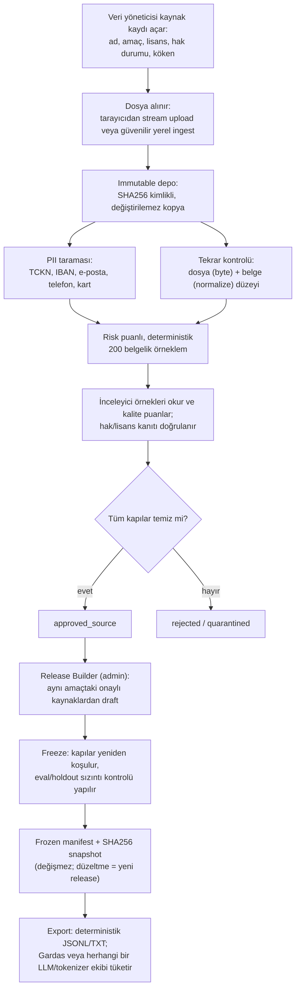
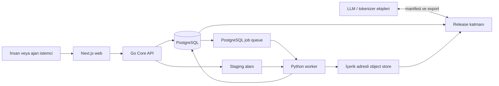

# Derlem

**Türkçe merkezli, modelden bağımsız, denetlenebilir yapay zekâ veri atölyesi.**

[Türkçe](README.md) | [English](README.en.md)

[](https://github.com/celikbros/derlem/actions/workflows/ci.yml)

Derlem; LLM ve tokenizer ekipleri için ham kaynakları kaydeden, dosyaları
içerik adresli değişmez depoya alan, otomatik kalite kapıları çalıştıran,
insan incelemesini izleyen ve yeniden üretilebilir frozen dataset release'leri
hazırlayan bir veri yönetim sistemidir.

Proje model eğitmez ve tokenizer koduna müdahale etmez. Eğitim ekipleri,
Derlem'in onaylanmış ve sürümlenmiş çıktılarını kendi model adaptörleriyle
kullanır.

> **Durum:** Aktif MVP geliştirmesi. Kaynak kataloğu, JWT tabanlı yetkilendirme,
> tarayıcıdan akışlı dosya yükleme, içerik adresli saklama, PostgreSQL iş
> kuyruğu, temel PII taraması, SHA256 exact-duplicate kapısı, bounded belge
> örnekleme, immutable belge sürümleri, kalite puanlı belge moderasyonu,
> exact pretrain dekontaminasyonu, frozen manifest/artifact indirme ve
> append-only audit çalışmaktadır.

## İçindekiler

- [Neden Derlem?](#neden-derlem)
- [Kapsam](#kapsam)
- [Nasıl Çalışır?](#nasıl-çalışır)
- [Tasarım İlkeleri](#tasarım-ilkeleri)
- [Mimari](#mimari)
- [Veri Yaşam Döngüsü](#veri-yaşam-döngüsü)
- [Kalite ve Güvenlik Kapıları](#kalite-ve-güvenlik-kapıları)
- [Modelden Bağımsız Veri](#modelden-bağımsız-veri)
- [Teknoloji Seçimleri](#teknoloji-seçimleri)
- [Proje Yapısı](#proje-yapısı)
- [Yerel Kurulum](#yerel-kurulum)
- [API Özeti](#api-özeti)
- [Testler](#testler)
- [Ölçekleme Yaklaşımı](#ölçekleme-yaklaşımı)
- [Yol Haritası](#yol-haritası)
- [Dokümantasyon](#dokümantasyon)
- [Güvenlik ve Lisans](#güvenlik-ve-lisans)

## Neden Derlem?

Model geliştirme ekiplerinin yalnızca daha fazla metne değil; kökeni bilinen,
hak durumu kaydedilmiş, hassas veri açısından taranmış, tekrarları kontrol
edilmiş ve hangi kararlarla onaylandığı izlenebilen veriye ihtiyacı vardır.

Derlem şu sorunları çözmek için tasarlanır:

- Ham corpus dosyalarının farklı klasörlerde kontrolsüz biçimde çoğalması.
- Lisans, kaynak, checksum ve işleme geçmişinin kaybolması.
- Eval/holdout içeriğinin yanlışlıkla eğitim havuzuna karışması.
- PII veya exact duplicate bulgularının sessizce release'e girmesi.
- Model-spesifik chat template'lerinin kanonik veriye gömülmesi.
- Bir dataset release'inin daha sonra aynı girdilerle üretilememesi.
- İnsan ve otomasyon kararlarının denetlenebilir bir kayıt bırakmaması.

İlk seed kaynak, `C:\CELIKBROS PROJECTS\gardash` altındaki mevcut Türkçe corpus'tur. Bu
yerel yol yalnızca lineage bilgisidir; bir kaynak, dosyası değişmez depoya
alınmadan onaylanmış veri sayılmaz.

Güncel Gardas/Faz 2 seed import kaydı için bkz. [Gardas Seed Import](docs/gardash_seed_import.md).

## Kapsam

### Derlem ne yapar?

- Kaynak metadata'sı, hak durumu, lisans kanıtı ve lineage kaydeder.
- TXT, JSONL, JSON, CSV ve TSV dosyalarını tarayıcıdan akışlı olarak alır.
- Dosyaları SHA256 kimliğiyle içerik adresli değişmez depoda saklar.
- Dosya boyutu, satır sayısı, encoding ve checksum üretir.
- TCKN, IBAN, e-posta, telefon ve ödeme kartı için temel PII taraması yapar.
- Byte-level SHA256 ile exact source-artifact tekrarlarını yakalar.
- Rol tabanlı insan incelemesi, ret gerekçesi ve self-review engeli uygular.
- Her önemli değişikliği append-only audit kaydına ekler.
- Onaylı verileri frozen release, SHA256 manifest ve indirilebilir artifact olarak sunar.

### Derlem ne yapmaz?

- LLM eğitimi veya tokenizer eğitimi çalıştırmaz.
- Model kalitesi veya hukuki uygunluk konusunda tek başına nihai hüküm vermez.
- Büyük metin blob'larını PostgreSQL içine basmaz.
- Modelin chat template'ini kanonik veri formatı olarak kabul etmez.
- Lisansı veya hak durumu belirsiz veriyi otomatik olarak onaylamaz.
- Mevcut frozen release'i yerinde değiştirmez; düzeltme yeni release'tir.

## Nasıl Çalışır?

Derlem'e veri iki kapıdan girer. Asıl hacim var olan büyük corpus dosyalarından
gelir (web derlemesi, kitap, veri seti, Gardas/Faz 2 gibi mevcut corpus'lar);
bunun yanında katkıcılar **Katkılar** ekranından kendi ürettikleri metni girebilir.
İkisi de aynı kalite kapılarından geçer; çıktı, eğitime hazır ve dondurulmuş veri
paketleridir. İnsanlar yalnız veri üretmez: kaynağı kaydeder, örnekleri inceler
ve kararı verir.



Sık karışan noktalar:

- **Kimse Derlem'e metin girmez.** İnsan rolleri kaydetmek (data manager),
  incelemek (moderator/expert reviewer), dondurmak (admin) ve tüketmektir
  (consumer team). Açık katkı kuyruğu v0.5 planıdır.
- **Lisans/hak kapısı, verinin kaynağının kullanım hakkıdır.** Dosya tüm teknik
  kapılardan geçse bile "bu metinleri kullanma hakkımız nedir" sorusu
  cevaplanıp kanıt referansı girilmeden kaynak onaylanamaz; hakkı `unknown`
  olan veri release'e giremez.
- **Her kaynak kayıt anında tek amaca bağlanır** (`pretrain`, `instruction`,
  `preference`, `eval`, `holdout`, `post_training`) ve bu amaç sonradan
  değiştirilemez. Eval/holdout içeriğinin eğitim havuzuna sızması böyle önlenir.
- **Çıktı modelden, tokenizer'dan ve model-spesifik etiketlerden bağımsızdır.**
  Aynı frozen release'i Gardas da, başka bir LLM/tokenizer ekibi de kendi
  adaptörüyle, veriyi yeniden onaylatmadan kullanır.

## Tasarım İlkeleri

1. **Kanonik veri modelden bağımsızdır.** GLM, DeepSeek, Kimi veya başka bir
   modelin template'i türetilmiş export katmanına aittir.
2. **Dosya kimliği path değil SHA256'dır.** Orijinal path yalnızca lineage
   bilgisidir.
3. **Haklar kapısı default-deny çalışır.** `unknown`, `restricted` veya
   `blocked` durumundaki kaynak onaylanamaz.
4. **Eval ve eğitim amacı kayıt anında ayrılır.** `content_purpose` zorunlu ve
   veritabanı trigger'ıyla değişmezdir.
5. **Audit kaydı append-only'dir.** Update, delete ve truncate veritabanı
   trigger'larıyla engellenir.
6. **İnsan ve ajan aynı yetki modeline tabidir.** Kritik freeze ve hak kararları
   insan kapısında kalır.
7. **Frozen release değişmez.** Kaynak kimlikleri ve checksum snapshot'ı freeze
   anında sabitlenir.
8. **Ölçek ölçümle büyür.** MVP'de PostgreSQL kuyruğu ve local object store;
   ihtiyaç kanıtlandığında S3/MinIO ve ayrı mesajlaşma katmanı kullanılır.

> **Garanti kapsamı (dürüstlük notu):** Append-only audit, immutable depo ve
> bağımsız inceleme garantileri; çok kullanıcılı, ayrıcalıkları ayrılmış bir
> kurulumda (ayrı DB rolleri, ayrı OS hesapları, birden fazla gerçek
> inceleyici) tam güç kazanır. Tek operatörlü yerel kurulumda bu mekanizmalar
> **disiplin provasıdır**: operatörün kendisine karşı teknik koruma
> sağlamazlar. Ayrıntı: [v1 Otopsi Raporu](docs/v1-autopsy.md).

## Mimari



### İstek yolu

Go API; auth, rol kontrolü, kaynak CRUD, optimistic locking, upload akışı,
inceleme kararları ve audit işlemlerini yürütür. API proses belleğinde session
state tutmaz; ortak oturum ve rate-limit durumu PostgreSQL'dedir. Bu nedenle
API instance'ları yatay çoğaltılabilir.

### Metadata ve iş kuyruğu

PostgreSQL; kullanıcılar, roller, kaynak metadata'sı, kalite durumları,
incelemeler, release kayıtları, audit olayları ve background job'ları tutar.
Worker'lar `FOR UPDATE SKIP LOCKED` ile çakışmadan iş alabilir.

### Dosya saklama

Ham ve işlenmiş büyük dosyalar PostgreSQL blob'u değildir. MVP'de storage
interface arkasındaki local filesystem kullanılır:

```text
var/storage/objects/sha256/aa/bb/<64-karakter-sha256>
```

Aynı interface ileride S3 veya MinIO implementasyonuna geçirilebilir.

### Ağır veri işleme

Python worker; immutable ingest, encoding kontrolü, satır sayımı, PII taraması,
source artifact exact-duplicate, normalize edilmiş document exact-dedup,
deterministik reservoir belge örnekleme, release freeze ve exact pretrain
dekontaminasyonu işlerini yürütür. İlerleyen fazlarda DuckDB/Polars tabanlı
shard üretimi ve birleşik export işleri bu katmana eklenecektir.

## Veri Yaşam Döngüsü

```text
source_registered
  -> browser upload veya güvenilir local ingest
  -> immutable SHA256 object
  -> raw_ingested
  -> scan_pii + check_exact_duplicate
  -> index_document_fingerprints
  -> sample_documents
  -> auto_checked | quarantined
  -> human review
  -> approved_source | rejected | sensitive_review
  -> release_candidate
  -> frozen release
```

1. Kullanıcı zorunlu metadata ile kaynak kaydı açar.
2. Dosya staging alanına stream edilir; RAM'e bütünüyle alınmaz.
3. Worker SHA256, byte size, line count ve UTF-8 durumunu hesaplar.
4. İçerik, SHA256 anahtarıyla immutable store'a atomik olarak alınır.
5. PII ve exact-duplicate işleri bağımsız job olarak çalışır.
6. Kanonik kaynak için normalize edilmiş document fingerprint index'i çıkarılır.
7. Document exact-dedup temizse bounded ve deterministik belge örnekleri çıkarılır.
8. Örnek içerikleri immutable object, sürüm metadata'sı PostgreSQL kaydıdır.
9. Tüm kapılar temizse yetkili reviewer karar verebilir.
10. Release Builder aynı `content_purpose` içindeki onaylı kaynakları seçer,
   kaynak sürümü ve SHA256 snapshot'ını alır, kalite kapılarını yeniden çalıştırır.
11. Freeze işi deterministik manifest üretir; manifest ve kaynak artifact'leri
    consumer ekiplerine salt-okunur indirme olarak sunulur.

## Kalite ve Güvenlik Kapıları

Bir kaynak `approved_source` olabilmek için:

| Kapı | Zorunlu sonuç | Neden |
| --- | --- | --- |
| Immutable ingest | `object_sha256` mevcut | İncelenen dosyanın sonradan değişmemesi |
| Hak durumu | `rights_status=cleared` | Belirsiz veya engelli veriyi reddetmek |
| Lisans kanıtı | `license_evidence_ref` mevcut | Kararın dayanağını izlemek |
| PII taraması | `pii_status=clear` | Hassas verinin sessiz geçmesini önlemek |
| Exact duplicate | `duplicate_status=unique` | Aynı artifact'in ikinci kez onaylanmasını engellemek |
| Normalize document dedup | `normalized_dedup_status=unique` | Aynı metnin farklı whitespace/case biçimleriyle tekrar onaylanmasını engellemek |
| Belge örnekleri | Tüm örnekler güncel sürümde onaylı | Kaynak kararını incelenmemiş içeriğe dayandırmamak |
| İnsan kararı | Yetkili reviewer | Otomasyonun kritik kararı tek başına vermemesi |

Duplicate kontrolü iki katmandır: `duplicate_status`, kaynak dosyanın byte-level
SHA256 eşitliğini yakalar; `normalized_dedup_status`, JSONL `text`, `content`,
`body` veya düz satır metnini NFKC + casefold + whitespace collapse ile
normalize edip document-level SHA256 fingerprint index'i üretir. Bu kapı ham
metni veritabanına yazmaz; yalnızca hash, ordinal ve sayaç saklar. Freeze sırasında
ayrı SimHash64 raporu release içi ve kaynaklar arası yakın tekrar çiftlerini ölçer.

PII taraması eşleşen ham değerleri veritabanına yazmaz; yalnızca tür bazında
sayım ve durum saklar. Geçerli TCKN checksum, IBAN mod-97 ve ödeme kartı Luhn
kontrolleri uygulanır.

Pretrain release freeze'i, kayıtlı `eval` ve `holdout` kaynaklarındaki belge
metinlerini SHA256 exact-match ile karşılaştırır. Hash indeksi geçici SQLite
dosyasında tutulur; eşleşme veya `MAX_DOCUMENT_BYTES` sınırını aşan belge varsa
freeze bloke edilir. Bu kapı near-dedup veya anlamsal benzerlik iddiası taşımaz.

## Modelden Bağımsız Veri

LLM'e giden prompt çoğu zaman düz metin değil; mesaj rolleri, tool call'lar,
multimodal parçalar, özel token'lar ve modele özgü chat template ile render
edilmiş bir dizidir. Derlem bu nedenle veritabanını tek bir modelin template'ine
göre tasarlamaz.

Kanonik yaklaşım:

- `conversation_sample`: bir görev veya konuşma örneği.
- `message`: `system`, `user`, `assistant` veya `tool` rolü.
- `message_part`: text, image, audio, video veya tool reference parçası.
- `tool_definition`, `tool_call`, `tool_result`: araç sözleşmesi ve yürütme izi.
- `preference`: aynı bağlam için `chosen` ve `rejected` mesaj dalları.
- `schema_version`: çalışan sözleşme için `derlem.canonical-sample.v1`.

Yeni model çıktığında veri tek tek yeniden onaylanmaz. Model ekibi kanonik
export'u kendi adapter'ıyla dönüştürür. Model adı, `model_compatibility`, chat
template, özel token ve render edilmiş prompt kanonik kayda kabul edilmez.

## Teknoloji Seçimleri

| Katman | Teknoloji | Seçim nedeni |
| --- | --- | --- |
| Core API | Go 1.25+ | Düşük bellek, güçlü concurrency, sade deployment ve yüksek istek kapasitesi |
| Metadata DB | PostgreSQL 17+ | Transaction, constraint, JSONB, audit ve güvenilir queue semantiği |
| Worker | Python 3.12+ | Veri işleme, PII ve ilerideki NLP ekosistemiyle güçlü uyum |
| Web | Next.js 16 + React 19 + TypeScript | Tip güvenli yönetim arayüzü ve server-side API proxy |
| Object storage | Local content-addressed store | MVP'de düşük operasyon yükü; S3/MinIO'ya açık interface |
| Job queue | PostgreSQL `SKIP LOCKED` | Ek servis gerektirmeden güvenilir MVP; ölçülürse Redis/NATS/Kafka |
| Auth | JWT + RBAC | İlk günden gerçek kimlik ve rol denetimi; ileride Keycloak/OAuth |
| CI | GitHub Actions | Go, Python ve web kontrollerini her push/PR'da tekrarlamak |

Rust yerine Go seçimi bilinçlidir: Derlem'in sıcak yolu ağ, auth, metadata ve
dosya akışıdır. Go bu iş yükünde yeterli performansı daha düşük geliştirme ve
bakım maliyetiyle sunar. CPU-ağır özel bir bileşen ölçümle darboğaz olursa o
bileşen bağımsız olarak Rust ile yazılabilir.

## Proje Yapısı

```text
cmd/api/                         Go API giriş noktası
cmd/migrate/                     PostgreSQL migration komutu
internal/auth/                   Parola, JWT, bootstrap admin
internal/database/               Bağlantı ve sıralı SQL migration'ları
internal/domain/                 API/domain veri tipleri
internal/httpapi/                Route, middleware ve handler'lar
internal/repository/             Transaction ve sorgu katmanı
internal/storage/                İçerik adresli storage interface'i
worker/src/derlem_worker/        Python background worker
worker/tests/                    Worker birim testleri
web/app/                         Next.js App Router ve API proxy
web/components/                  Yönetim arayüzü bileşenleri
web/tests/e2e/                   Playwright senaryoları
schemas/                         Modelden bağımsız JSON Schema sözleşmeleri
data_samples/                    Küçük ve güvenli örnek kayıtlar
docs/                            Mimari, yönetişim ve danışman belgeleri
```

## Yerel Kurulum

### Gereksinimler

- Go 1.25+
- PostgreSQL 17+
- Python 3.12+
- Node.js 22+

Docker, Redis veya MinIO yerel MVP için zorunlu değildir.

### 1. Yapılandırma

```powershell
Copy-Item .env.example .env
Copy-Item web/.env.local.example web/.env.local
```

`.env` içinde en az `DATABASE_URL`, güçlü bir `JWT_SECRET` ve bootstrap admin
bilgilerini yerel değerlerle değiştirin. Gerçek secret'ları commit etmeyin.

Başlıca ayarlar:

| Değişken | Amaç |
| --- | --- |
| `DATABASE_URL` | PostgreSQL bağlantısı |
| `JWT_SECRET` | En az 32 karakterli token imza anahtarı |
| `BOOTSTRAP_ADMIN_EMAIL` | İlk admin hesabı |
| `BOOTSTRAP_ADMIN_PASSWORD` | İlk admin parolası |
| `STORAGE_ROOT` | Immutable object store kökü |
| `STAGING_ROOT` | Stream upload geçici alanı |
| `IMPORT_ROOT` | Yalnız admin local-ingest dosyalarının bulunduğu güvenilir kök |
| `MAX_UPLOAD_BYTES` | Tek upload üst sınırı; varsayılan 50 GiB |
| `WORKER_POLL_INTERVAL` | Worker queue polling aralığı |
| `WORKER_LEASE_TIMEOUT` | Heartbeat kesilen running işin stale sayılma süresi; varsayılan 5 dakika |
| `WORKER_HEARTBEAT_INTERVAL` | Running iş lease yenileme aralığı; varsayılan 30 saniye |
| `DOCUMENT_SAMPLE_SIZE` | Kaynak başına bounded review örneği; varsayılan 200 |
| `MAX_DOCUMENT_BYTES` | Örnekleme/dekontaminasyon belge üst sınırı; varsayılan 256 KiB |
| `EXTRACTION_MAX_SOURCE_BYTES` | PDF/DOCX parser kaynak üst sınırı; varsayılan 100 MiB |
| `EXTRACTION_MAX_DOCX_ENTRIES` | DOCX ZIP girdi üst sınırı; varsayılan 2.048 |
| `EXTRACTION_MAX_DOCX_UNCOMPRESSED_BYTES` | DOCX açılmış toplam içerik üst sınırı; varsayılan 256 MiB |
| `EXTRACTION_MAX_PDF_PAGES` | PDF sayfa üst sınırı; varsayılan 1.000 |
| `EXTRACTION_MAX_OUTPUT_CHARS` | Çıkarılan normalize metnin toplam üst sınırı; varsayılan 32 Mi karakter |
| `NEXT_PUBLIC_LOCAL_LOGIN_EMAIL` | Yalnızca local login kartında gösterilecek hesap |
| `NEXT_PUBLIC_LOCAL_LOGIN_PASSWORD` | Yalnızca local login kartında gösterilecek parola |
| `DERLEM_COOKIE_SECURE` | Web oturum çerezinin `Secure` bayrağı; yalnız güvenilir ofis ağında düz HTTP için `false` ([Ofis Kurulumu](docs/ofis_kurulumu.md)) |

`NEXT_PUBLIC_LOCAL_LOGIN_*` değerleri browser bundle'ında görünür. Yalnızca
ignore edilen `web/.env.local` dosyasında ve local geliştirme ortamında kullanın.

### 2. Bağımlılıklar ve migration

```powershell
go mod download
go run ./cmd/migrate

python -m venv .venv
.\.venv\Scripts\python.exe -m pip install -e ".\worker[dev]"

Set-Location web
npm ci
Set-Location ..
```

### 3. Servisleri çalıştırma

Üç ayrı terminal açın:

```powershell
go run ./cmd/api
```

```powershell
.\.venv\Scripts\python.exe -m derlem_worker --worker-id local-worker
```

```powershell
Set-Location web
npm run dev
```

- Web: `http://localhost:18400`
- API: `http://localhost:18401`
- Liveness: `http://localhost:18401/health/live`
- Readiness: `http://localhost:18401/health/ready`

Ayrıntılı yönergeler: [docs/local_development.md](docs/local_development.md)

## API Özeti

| Method | Endpoint | Amaç |
| --- | --- | --- |
| `POST` | `/api/v1/auth/login` | JWT oturumu açar |
| `POST` | `/api/v1/auth/logout` | Geçerli sunucu oturumunu revoke eder |
| `POST` | `/api/v1/auth/logout-all` | Kullanıcının tüm sunucu oturumlarını revoke eder |
| `GET` | `/api/v1/me` | Aktif kullanıcı ve rolleri |
| `GET/POST` | `/api/v1/users` | Kullanıcı listesi ve oluşturma (yalnız admin) |
| `PATCH` | `/api/v1/users/{id}` | Rol/durum/parola güncelleme (yalnız admin) |
| `GET/POST` | `/api/v1/sources` | Kaynakları listeler veya oluşturur |
| `GET/PATCH` | `/api/v1/sources/{id}` | Kaynak ayrıntısı ve optimistic update |
| `POST` | `/api/v1/sources/{id}/upload` | Tarayıcıdan stream upload |
| `POST` | `/api/v1/sources/{id}/ingest` | Güvenilir yerel path ingest'i |
| `GET/POST` | `/api/v1/sources/{id}/reviews` | İnceleme geçmişi ve karar |
| `GET` | `/api/v1/sources/{id}/pii-scans` | PII tarama sonuçları |
| `GET` | `/api/v1/sources/{id}/documents` | Bounded belge örnekleri |
| `GET` | `/api/v1/sources/{id}/document-sample-generations` | Aktif/arşiv örnek nesillerini listeler |
| `POST` | `/api/v1/sources/{id}/documents/resample` | Review başlamamış kaynağı kontrollü yeniden örnekler |
| `POST` | `/api/v1/sources/{id}/documents/bulk-reviews` | En fazla 200 bekleyen belgeyi atomik toplu inceleme |
| `GET/PATCH` | `/api/v1/documents/{id}` | Immutable içerik okuma veya yeni sürüm |
| `GET/POST` | `/api/v1/documents/{id}/reviews` | Belge kalite puanı ve moderasyon geçmişi |
| `GET` | `/api/v1/jobs` | Background job görünümü |
| `GET/POST` | `/api/v1/releases` | Release listesi veya onaylı kaynaklardan draft oluşturma |
| `GET` | `/api/v1/releases/{id}` | Release, kaynak snapshot'ları ve gate sonuçları |
| `POST` | `/api/v1/releases/{id}/freeze` | Admin kontrollü freeze işini kuyruğa alma |
| `POST` | `/api/v1/releases/{id}/exports` | Frozen release için deterministik JSONL/TXT export kuyruğa alma |
| `GET` | `/api/v1/releases/{id}/manifest` | Frozen manifest indirme |
| `GET` | `/api/v1/releases/{id}/exports/{format}/artifact` | Hazır kanonik export'u indirme |
| `GET` | `/api/v1/releases/{id}/exports/{format}/manifest` | Export manifestini indirme |
| `GET` | `/api/v1/releases/{id}/sources/{source_id}/artifact` | Frozen kaynak artifact'i indirme |

Listeleme cursor pagination kullanır. Metadata güncellemesi mevcut `version`
değerini ister ve çakışmada `409 version_conflict` döndürür.

## Testler

```powershell
go test ./...

.\.venv\Scripts\python.exe -m pytest worker\tests

Set-Location web
npm run typecheck
npm run lint
npm run build
npm audit --audit-level=moderate
```

Playwright için çalışan API/web servisleri ve yerel E2E hesabı gerekir:

```powershell
$env:E2E_EMAIL='admin@derlem.local'
$env:E2E_PASSWORD='your-local-password'
npm run test:e2e
```

Parola yerine kısa ömürlü yerel bir JWT, `E2E_TOKEN` ile verilebilir.

Mutating upload senaryosu ayrıca `E2E_MUTATING=1` ile açıkça etkinleştirilir.

## Ölçekleme Yaklaşımı

Milyonlarca kullanıcı yalnızca programlama dili seçimiyle çözülmez. Derlem şu
ölçekleme sınırlarını korur:

- API proses-local state tutmaz; ortak session/rate-limit state PostgreSQL'de
  olduğu için birden fazla Go instance'ı çalıştırılabilir.
- Büyük upload API belleğine alınmadan stream edilir.
- Dosya verisi DB yerine object storage'da tutulur.
- Job tüketicileri `SKIP LOCKED` ile yatay çoğaltılabilir.
- Cursor pagination büyük kataloglarda offset maliyetini önler.
- Optimistic locking eşzamanlı edit kaybını engeller.
- Storage interface local diskten S3/MinIO'ya geçişi izole eder.
- Ölçülen queue baskısında Redis Streams, NATS veya Kafka değerlendirilebilir.

Kubernetes ve mikroservisler MVP önkoşulu değildir. Önce tek makinede ölçüm,
sonra kanıtlanan darboğaza göre ayrıştırma yapılır.

## Yol Haritası

Ayrıntılı versiyon hedefleri için [Derlem Versiyon Yol Haritası](docs/version_roadmap.md)
belgesini izleyin. Özetle: **v0.1 Core MVP ve v0.3 kalite/yapısal export
hedefleri tamamlandı; v0.2'nin büyük corpus teknik altyapısı çalışıyor, Gardas
insan/hak operasyonu sürüyor; sıradaki teknik hedef v0.4.**

### Tamamlanan çalışan dilim

- [x] Go API, JWT auth ve RBAC
- [x] PostgreSQL migration ve append-only audit
- [x] Kaynak kataloğu, cursor pagination ve optimistic locking
- [x] Tarayıcıdan akışlı upload ve local güvenilir ingest
- [x] İçerik adresli immutable storage
- [x] PostgreSQL background job queue
- [x] TCKN/IBAN/kart/telefon/e-posta PII taraması
- [x] Source artifact SHA256 exact-duplicate kapısı
- [x] Normalize edilmiş document exact-dedup fingerprint kapısı
- [x] Deterministik ve bounded belge örnekleme
- [x] Açıklanabilir risk puanlı, temsil + risk kotasını birleştiren örnekleme
- [x] Nesil ve üyelik snapshot'lı, atomik kontrollü yeniden örnekleme
- [x] Büyük ingest, PII, fingerprint ve sample işlerinde canlı byte/satır/doküman ilerlemesi
- [x] Kaynak öneki doğrulamalı, job UUID'sine bağlı büyük ingest resume/checkpoint akışı
- [x] Object store tabanlı immutable belge sürümleri ve editor diyaloğu
- [x] Belge kalite puanı, immutable review geçmişi ve tam örnek kapsama kapısı
- [x] Sürüm kontrollü ve atomik toplu belge inceleme
- [x] Sürüm kontrollü beş boyutlu insan kalite rubric'i ve kaynak ortalamaları
- [x] Moderasyon, ret gerekçesi ve self-review engeli
- [x] Aynı amaçtaki onaylı kaynaklardan draft/frozen Release Builder
- [x] Deterministik manifest, kaynak sürümü ve SHA256 snapshot'ı
- [x] Eval/holdout ile pretrain document exact decontamination
- [x] Eval/holdout ile report-only SimHash64 yaklaşık decontamination pilotu
- [x] Tüm release amaçları için report-only kaynak içi/kaynaklar arası SimHash64 near-dedup raporu
- [x] Purpose-aware, token uzunluk bantlı ve ham metinsiz SimHash kalibrasyon raporu CLI'si
- [x] Sunucu taraflı körleme ve append-only çok kullanıcılı benzerlik çifti inceleme akışı
- [x] Frozen release'ten deterministik, modelden bağımsız JSONL/TXT Export Builder
- [x] Export artifact ve manifest SHA256 doğrulaması, ilerleme metrikleri ve rol kontrollü indirme
- [x] Conversation/tool/preference için `derlem.canonical-sample.v1` doğrulama ve yapısal JSONL export
- [x] Export manifestinde yöntem kimlikli, modelden bağımsız token tahmin aralığı
- [x] Frozen release için kaynak dağılımı, kalite bantları, coverage ve review snapshot SHA256 içeren mixture v2 raporu
- [x] Frozen manifest ve kaynak artifact indirme
- [x] Next.js yönetim arayüzü
- [x] GitHub Actions CI

### Sıradaki işler

- [ ] Çoklu shard/Parquet paketleme
- [ ] İçe alınan 100 Gardas çiftinin bağımsız insan etiketleri ve purpose-specific yöntem/eşik kararı
- [ ] S3/MinIO object store implementasyonu
- [ ] Keycloak/OAuth ve servis hesapları

## Dokümantasyon

- [Hızlı başlangıç: ilk kaynağınızı uçtan uca geçirin](docs/hizli_baslangic.md)
- [Senaryolarla Derlem: ekipler için kullanım kılavuzu](docs/senaryolar.md)
- [Alan (domain) taksonomisi](docs/alan_taksonomisi.md)
- [Distilasyon: LLM'den sentetik veri üretimi](docs/distilasyon.md)
- [Kapsamlı proje ve devir teslim raporu](docs/derlem_kapsamli_proje_raporu.md)
- [Gardash tüketici geri bildirimi ve kapanış planı](docs/gardash_feedback_2026_07.md)
- [v2 alım planı: web-ölçekli TR + sentetik ders kitabı](docs/v2_intake_plan.md)
- [MVP planı](docs/web_data_atolyesi_mvp_plan.md)
- [v1 Otopsi raporu](docs/v1-autopsy.md)
- [Diyet yol haritası (AKTİF)](docs/diyet_yol_haritasi.md)
- [Versiyon yol haritası (donduruldu)](docs/version_roadmap.md)
- [Proje tamamlanma durumu](docs/project_completion_status.md)
- [Yerel geliştirme](docs/local_development.md)
- [Yedekleme ve restore runbook'u](docs/backup_restore.md)
- [Local rol test kullanıcıları](docs/local_role_testing.md)
- [Production deployment](docs/production_deployment.md)
- [API yetkilendirme matrisi](docs/api_authorization_matrix.md)
- [Oturum ve login güvenliği](docs/session_security.md)
- [Güvenlik hardening backlog'u](docs/security_hardening_backlog.md)
- [Security hardening backlog (English)](docs/security_hardening_backlog.en.md)
- [API ve iş akışları](docs/api_workflows.md)
- [Risk bazlı örnekleme](docs/risk_sampling.md)
- [Kontrollü yeniden örnekleme](docs/document_resampling.md)
- [Kesintiden devam eden büyük ingest](docs/resumable_ingest.md)
- [Resumable large-file ingest (English)](docs/resumable_ingest.en.md)
- [Arka plan işi ilerleme sözleşmesi](docs/job_progress.md)
- [Çok boyutlu belge kalitesi](docs/multidimensional_quality.md)
- [Kanonik export sözleşmesi](docs/canonical_exports.md)
- [Release mixture raporu](docs/release_mixture_report.md)
- [Release mixture report (English)](docs/release_mixture_report.en.md)
- [Yaklaşık dekontaminasyon pilotu](docs/approximate_decontamination.md)
- [Approximate decontamination pilot (English)](docs/approximate_decontamination.en.md)
- [Release yakın tekrar raporu](docs/release_near_dedup_report.md)
- [Release near-duplicate report (English)](docs/release_near_dedup_report.en.md)
- [SimHash kalibrasyon raporu](docs/similarity_calibration.md)
- [SimHash calibration report (English)](docs/similarity_calibration.en.md)
- [Benzerlik çifti incelemesi](docs/similarity_pair_review.md)
- [Similarity pair review (English)](docs/similarity_pair_review.en.md)
- [Pretraining data factory](docs/pretraining_data_factory.md)
- [Model prompt format soyutlaması](docs/model_prompt_format_abstraction.md)
- [Ölçeklenebilirlik mimarisi](docs/scalability_architecture.md)
- [Web uygulama tasarımı](docs/web_app_design.md)
- [Veri yönetişimi](docs/data_governance.md)
- [Görev taksonomisi](docs/task_taxonomy.md)
- [Danışman yanıtı](docs/advisor_response_web_data_atolyesi_mvp.md)

## Katkı

Kod, schema veya yönetişim değişikliği yapmadan önce
[CONTRIBUTING.md](CONTRIBUTING.md) belgesini okuyun. Değişiklikler küçük,
test edilebilir ve audit/release garantilerini zayıflatmayacak şekilde
tasarlanmalıdır.

## Güvenlik ve Lisans

Güvenlik açığını normal issue olarak yayımlamayın;
[SECURITY.md](SECURITY.md) içindeki özel bildirim yolunu kullanın.

Bu repo için henüz açık kaynak lisansı seçilmemiştir. Repo private tutulur ve
aksi yazılı olarak belirtilmedikçe içerik yeniden kullanım izni vermez.
