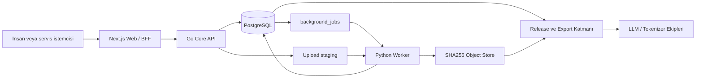

# Derlem Kapsamlı Proje ve Devir Teslim Raporu

**Belge sürümü:** 1.0

**Durum tarihi:** 2026-07-02

**Hedef okuyucu:** Projeyi devralacak mühendislik, veri operasyonu, güvenlik,
ürün ve hukuk ekipleri

**GitHub:** `https://github.com/celikbros/derlem`

**Ana dal:** `main`

**Kanonik yerel dizin:** `C:\CELIKBROS PROJECTS\derlem`

**Eski yollar:** `C:\CELIK- DERLEM` ve `C:\TURKCE-VERI-ATOLYESI` junction'ı kullanımdan kalktı; proje 2026-07-05 itibarıyla `C:\CELIKBROS PROJECTS\derlem` altındadır.

Bu belge Derlem'in neden kurulduğunu, bugün gerçekten ne yaptığını, hangi
kararların bilinçli olduğunu, canlı yerel verinin durumunu ve projeyi devralan
ekibin hangi sırayla ilerlemesi gerektiğini tek yerde anlatır. Kod ve SQL
migration'ları davranışın nihai kaynağıdır; bu rapor 2026-07-02 tarihli
doğrulanmış proje fotoğrafıdır.

## 1. Yönetici Özeti

Derlem; LLM ve tokenizer ekiplerine **modelden bağımsız, kökeni izlenebilir,
kalite kapılarından geçmiş ve yeniden üretilebilir veri sürümleri** hazırlayan
bir veri atölyesidir. Model eğitmez, tokenizer geliştirmez ve bir modelin chat
template'ini kanonik veri biçimi olarak saklamaz.

Sistem bugün yerel ortamda uçtan uca çalışmaktadır:

1. Kaynak ve zorunlu metadata kaydedilir.
2. Dosya SHA256 kimliğiyle değişmez depoya alınır.
3. PII, exact duplicate ve normalize belge tekrarı kontrolleri çalışır.
4. Büyük corpus'tan sınırlı ve risk ağırlıklı insan inceleme örneği çıkarılır.
5. Belge ve kaynak kararları kullanıcı, zaman, sürüm ve checksum ile kaydedilir.
6. Onaylı kaynaklardan draft release hazırlanır.
7. Release kapıları yeniden çalıştırılır ve başarılı sonuç frozen manifest olur.
8. Model ekiplerine deterministik JSONL/TXT artifact ve manifest verilir.

Çekirdek MVP ile v0.3 teknik hedefleri tamamlanmıştır. Büyük Gardas corpus'u
teknik olarak içeri alınmış ve temiz aday üretilmiştir; fakat **ilk gerçek büyük
release henüz hazır değildir**. Gardas temiz adayında 200 örnek insan incelemesi,
hak/lisans kararı ve 100 benzerlik çiftinin kalibrasyon incelemesi beklemektedir.

Internet-facing production şu anda **açılmamalıdır**. Sekiz P0 güvenlik
maddesinden authorization ve session güvenliği kapatılmış, `SEC-P0-03..08`
açıktır. Ayrıntılar [Güvenlik Hardening Backlog'u](security_hardening_backlog.md)
içindedir.

### Hızlı durum tablosu

| Alan | Durum | Açıklama |
|---|---|---|
| Yerel Core MVP | Tamamlandı | Kaynak -> kapılar -> review -> frozen release çalışıyor |
| v0.2 büyük corpus tekniği | Tamamlandı | Gardas ingest, fingerprint, örnekleme ve resume hazır |
| v0.3 review/export | Tamamlandı | Toplu review, kalite rubric'i ve JSONL/TXT export hazır |
| v0.4 ileri kalite | Aktif | Near-dedup ve decontam pilotları hazır; insan kalibrasyonu bekliyor |
| Gardas büyük release | Bloklu | Hak/lisans + 200 belge + 100 benzerlik çifti kararı gerekiyor |
| Production güvenliği | Bloklu | Açık P0 maddeleri kapanmadan dış erişim verilmemeli |
| v1.0 | Hedef | Hukuk/KVKK, prod altyapı, SLA ve gerçek model tüketimi gerekiyor |

## 2. Problem ve Ürün Amacı

Model ekiplerinin ihtiyacı yalnız daha fazla metin değildir. Veri:

- nereden geldiği bilinmeden,
- lisans ve kullanım hakkı kaydedilmeden,
- kişisel veri taramasından geçmeden,
- tekrarları ve eval sızıntısı ölçülmeden,
- insan kararının kanıtı tutulmadan,
- release girdileri sabitlenmeden

eğitime verilirse sorun çoğu zaman model eğitildikten sonra fark edilir. Derlem,
bu kararları klasör adları ve ekip hafızası yerine kod, veritabanı constraint'i,
değişmez nesne ve audit kaydıyla zorlamak için kurulmuştur.

Başarı ölçütü rastgele metin hacmi değildir. Öncelikler şunlardır:

- yüksek sinyalli ve doğal Türkçe,
- köken ve hak kanıtı,
- PII ve güvenlik kontrolü,
- ölçülmüş tekrar ve eval ayrımı,
- insan incelemesinin izlenebilirliği,
- aynı girdiden aynı release/export'un yeniden üretilebilmesi.

## 3. Kapsam ve Sorumluluk Sınırı

### Derlem'in sorumluluğu

- Ham ve türetilmiş veri kaynaklarını kataloglamak.
- Kaynak, dil, alan, lisans, hak, lineage ve `content_purpose` kaydetmek.
- Büyük dosyaları içerik adresli değişmez depoya almak.
- Otomatik kalite ve güvenlik kapılarını çalıştırmak.
- İnsan edit, review, ret ve onay zincirini yürütmek.
- Eval/holdout ile pretrain ayrımını korumak.
- Onaylı kaynaklardan frozen release ve deterministik export üretmek.
- Her kritik işlemi kullanıcı ve zaman bilgisiyle audit etmek.

### Derlem'in sorumluluğu olmayan işler

- LLM veya tokenizer eğitimi.
- Model mimarisi, loss, optimizer veya eğitim hiperparametresi seçimi.
- GLM, DeepSeek, Kimi, Gardas veya başka modele prompt render etmek.
- Kesin hukuki uygunluk kararı vermek.
- Model kalitesini tek başına garanti etmek.
- Büyük corpus metnini PostgreSQL blob'u olarak saklamak.

### Ekipler arası sözleşme

Derlem **üretici**, LLM/tokenizer ekipleri **tüketicidir**:

```text
Derlem
  -> canonical JSONL/TXT
  -> release manifesti
  -> source ve artifact SHA256 değerleri
  -> gate/mixture/quality raporları
  -> lineage

Model veya tokenizer ekibi
  -> hedef model adapter'ı
  -> chat template / özel token uygulaması
  -> tokenizer ile exact token sayımı
  -> shard/tokenized training artifact'i
  -> adapter/template/tokenizer sürüm manifesti
```

Yeni bir model çıktığında Derlem verisi model bazında yeniden onaylanmaz. Yeni
model için tüketici adapter'ı hazırlanır.

## 4. Temel Tasarım İlkeleri

1. **Kanonik veri modelden bağımsızdır.** Model adı, chat template, render
   edilmiş prompt ve tokenizer sonucu kanonik kayda girmez.
2. **Dosya kimliği path değil SHA256'dır.** Orijinal path yalnız lineage'dır.
3. **Ham veri yerinde değiştirilmez.** Temizlik yeni bir türetilmiş nesne ve
   lineage üretir.
4. **Frozen release değişmez.** Düzeltme aynı release'i değiştirmek değil, yeni
   sürüm çıkarmaktır.
5. **Haklar varsayılan reddir.** `unknown`, `restricted` veya `blocked` kaynak
   release'e giremez.
6. **Veri amacı zorunlu ve değişmezdir.** `content_purpose` kayıt anında seçilir
   ve DB trigger'ıyla korunur.
7. **Eval ile eğitim ayrıdır.** Pretrain freeze'i eval/holdout exact eşleşmede
   bloke edilir; yaklaşık kontrol ayrıca raporlanır.
8. **Audit append-only'dir.** Update, delete ve truncate DB trigger'ıyla
   reddedilir.
9. **Büyük corpus kaynak/shard bazında onaylanır.** Her satırı insanın okuması
   yerine risk bazlı örnekleme ve sert otomatik kapılar kullanılır.
10. **Ölçek kanıtla büyütülür.** PostgreSQL kuyruğu ve local store yeterliyken
    ek dağıtık sistem kurulmaz; ölçülmüş ihtiyaçta S3/MinIO ve ayrı kuyruk gelir.

## 5. Sistem Mimarisi



### Bileşenler

| Bileşen | Sorumluluk | Neden bu teknoloji? |
|---|---|---|
| Go Core API | Auth, RBAC, CRUD, optimistic locking, review, release orchestration | Düşük bellek, güçlü concurrency, sade tek binary dağıtım |
| PostgreSQL | Metadata, ilişkiler, transaction, session, rate limit, job ve audit | Constraint, JSONB, transaction ve `SKIP LOCKED` semantiği |
| Python worker | Ingest, tarama, dedup, örnekleme, freeze, export, kalibrasyon | Veri/NLP ekosistemi ve batch iş geliştirme hızı |
| Next.js web | Operasyon arayüzü ve BFF | Tip güvenli React arayüzü ve server-side API proxy |
| Object store | Ham, türetilmiş, örnek, manifest ve export artifact'leri | Büyük metni DB'den ayırmak ve checksum kimliğiyle saklamak |

### Neden Go, neden Rust değil?

API'nin sıcak yolu ağ, auth, PostgreSQL, metadata ve akışlı upload işidir. Go bu
yükte gerekli performansı düşük bakım maliyetiyle verir. Rust tüm backend için
ek karmaşıklık yaratır; ölçülmüş bir hash/parser/dedup darboğazı oluşursa dar bir
yardımcı CLI olarak eklenebilir.

### PostgreSQL neden tek başına dosya deposu değil?

PostgreSQL metadata ve transaction için merkezdir; 13 GB corpus gibi büyük
metinleri blob olarak tutmak backup, replication, VACUUM ve sorgu işletimini
gereksiz ağırlaştırır. Dosya içeriği object store'da, bu içeriğin kimliği,
durumu, kökeni ve kararları PostgreSQL'dedir.

### Kuyruk neden PostgreSQL'de?

MVP iş kuyruğu `background_jobs` tablosudur. Worker'lar `FOR UPDATE SKIP
LOCKED` ile aynı işi çakışmadan alır. Redis Streams, NATS veya Kafka bugün
zorunlu değildir. Queue depth, dispatch gecikmesi veya throughput ölçümü
PostgreSQL'in yetmediğini gösterirse geçiş yapılacaktır.

## 6. Teknoloji ve Sürüm Envanteri

| Alan | Güncel seçim |
|---|---|
| Go modülü | `github.com/celikbros/derlem` |
| Go | `1.25.0` |
| PostgreSQL driver | `pgx/v5 v5.7.6` |
| Python | `>=3.12` |
| Python DB | `psycopg[binary] >=3.2,<4` |
| Next.js | `16.2.9` |
| React | `19.2.7` |
| TypeScript | `5.9.x` |
| Playwright | `1.61.0` |
| İkonlar | `lucide-react 1.21.0` |
| Veritabanı | Yerelde PostgreSQL 17+, deployment minimum 16+ |
| Migration | `000001` - `000018` |

Docker, Kubernetes, Redis, Kafka ve MinIO yerel MVP'nin çalışması için zorunlu
değildir.

## 7. Depo Yapısı

```text
cmd/api/                         Go API giriş noktası
cmd/migrate/                     SQL migration çalıştırıcısı
internal/auth/                   Parola, JWT, session ve bootstrap auth
internal/config/                 Ortam değişkenleri
internal/database/               PostgreSQL bağlantısı ve migration'lar
internal/domain/                 Domain ve API tipleri
internal/httpapi/                Route, middleware ve handler'lar
internal/repository/             SQL ve transaction katmanı
internal/storage/                Content-addressed storage interface'i
worker/src/derlem_worker/        Python worker ve operasyon CLI'ları
worker/tests/                    Python birim testleri
web/app/                         Next.js App Router ve BFF route'ları
web/components/                  Operasyon UI bileşenleri
web/tests/e2e/                   Playwright rol/session senaryoları
schemas/                         Kanonik JSON Schema sözleşmeleri
data_samples/                    Küçük, güvenli örnek kayıtlar
deploy/                          Build, systemd, Nginx ve env şablonları
docs/                            Mimari, süreç, runbook ve karar belgeleri
var/                             Git dışı object store, rapor ve türetilmiş veri
```

Eski `C:\TURKCE-VERI-ATOLYESI` junction'ı ve `C:\CELIK- DERLEM` dizini artık
kullanılmaz; hedefi silindiği için junction askıdadır ve kaldırılabilir. Komut ve
belgelerde yalnızca kanonik `C:\CELIKBROS PROJECTS\derlem` yolu kullanılmalıdır.

## 8. Veri Modeli

2026-07-02 tarihinde veritabanında 24 uygulama tablosu vardır. Ana gruplar:

### Kimlik ve yetki

- `users`
- `roles`
- `user_roles`
- `auth_sessions`
- `login_rate_limits`

### Kaynak ve saklama

- `sources`
- `storage_objects`
- `pii_scans`
- `document_fingerprints`

### Belge örnekleri ve insan incelemesi

- `documents`
- `document_versions`
- `document_reviews`
- `document_sample_generations`
- `document_sample_memberships`
- `reviews` (kaynak kararları)

### Release ve export

- `releases`
- `release_sources`
- `release_exports`

### Benzerlik kalibrasyonu

- `similarity_calibration_runs`
- `similarity_review_pairs`
- `similarity_pair_reviews`

### Operasyon ve kanıt

- `background_jobs`
- `audit_events`
- `schema_migrations`

Tam corpus metni bu tablolara gömülmez. PostgreSQL'de hash, ordinal, sayaç,
durum ve karar kanıtı; object store'da dosya içeriği bulunur.

## 9. Veri Yaşam Döngüsü

```text
source_registered
  -> browser upload veya güvenilir local ingest
  -> immutable SHA256 object
  -> raw_ingested
  -> scan_pii + check_exact_duplicate
  -> index_document_fingerprints
  -> sample_documents
  -> auto_checked | quarantined
  -> document edit/review
  -> source review
  -> approved_source
  -> draft release
  -> freeze gates
  -> frozen release
  -> deterministic JSONL/TXT export
```

### Ingest

Browser upload staging'e akış halinde yazılır; tüm dosya RAM'e alınmaz. Worker
SHA256, UTF-8 durumu, byte ve satır sayısını hesaplar, içeriği şu yapıya alır:

```text
STORAGE_ROOT/objects/sha256/aa/bb/<sha256>
```

Güvenilir yerel ingest yalnız admin içindir ve `IMPORT_ROOT` altındaki symlink
içermeyen normal dosyalarla sınırlıdır; API ve worker yolu ayrı ayrı doğrular.
Public katkı için sunucu path'i kabul edilmemeli; ileride presigned object-store upload
kullanılmalıdır.

### PII kapısı

Temel tarama şunları sayar:

- checksum doğrulamalı TCKN,
- mod-97 doğrulamalı IBAN,
- Luhn doğrulamalı ödeme kartı,
- telefon,
- e-posta.

Ham eşleşme değeri DB'ye veya rapora yazılmaz; yalnız kategori sayımları ve
durum saklanır.

### Duplicate kapıları

- `duplicate_status`: byte-level source SHA256 tekrarı.
- `normalized_dedup_status`: NFKC + casefold + whitespace collapse sonrası
  belge SHA256 tekrarı.
- Release near-dedup: SimHash64 aday çift raporu; bugün report-only'dir.

### İnsan örneklemesi

Tam corpus'un metni `documents` tablosuna doldurulmaz. Varsayılan en fazla 200
örnek, `risk-stratified-sha256-v1` ile seçilir. Kotanın en fazla yarısı riskli
biçim/uzunluk/kontrol karakteri/kimlik-iletişim desenlerinden, kalanı
deterministik temsil örnekleminden gelir. Tam örnek object store'da, preview ve
metadata PostgreSQL'dedir.

### Edit ve review

Belge edit'i eski içeriğin üzerine yazmaz; yeni `document_versions` satırı ve
yeni immutable nesne üretir. Optimistic locking için `version` zorunludur.
Yeni sürüm, eski review'u geçersiz kılmaz; onu eski sürüm kanıtı olarak tutar ve
güncel sürümün yeniden incelenmesini gerektirir.

Review kararları:

- `approved`
- `rejected`
- `sensitive_review`

Yeni review'lar `multidimensional-v1` ile genel, dil, tutarlılık, bilgi
yoğunluğu ve temizlik boyutlarını `1..5` aralığında taşır. Toplu review en fazla
200 belgeyi tek PostgreSQL transaction'ında işler; bir belge değişmişse tüm
işlem geri alınır.

### Kaynak onay kapısı

Bir kaynak ancak şu koşulların tümüyle `approved_source` olabilir:

| Kapı | Gerekli durum |
|---|---|
| Immutable ingest | `object_sha256` mevcut |
| Hak | `rights_status=cleared` |
| Lisans kanıtı | `license_evidence_ref` mevcut |
| PII | `clear` |
| Artifact duplicate | `unique` |
| Normalize belge duplicate | `unique` |
| Örnekleme | `sampled` |
| Belge review | Güncel örneklerin tamamı onaylı |
| İnsan kararı | Yetkili reviewer ve self-review yasağı |

### Release freeze

Release yalnız aynı `content_purpose` içindeki onaylı kaynaklardan oluşur.
Draft oluşturulurken source version ve SHA256 snapshot alınır. Freeze sırasında
kapılar tekrar çalışır; kaynak değişmişse işlem reddedilir.

Pretrain release için eval/holdout exact decontamination sert kapıdır. Ayrıca
SimHash64 yaklaşık decontamination ve near-dedup raporları üretilir; bunlar
bugün otomatik silme yapmaz ve tek başına freeze'i bloke etmez. Başarılı freeze
`derlem.release-manifest.v1` üretir; frozen kayıtlar DB trigger'larıyla korunur.

### Export

Frozen release'ten:

- `jsonl`: düz veya yapısal kanonik kayıt,
- `txt`: yalnız düz belge, satır başına bir UTF-8 kayıt

üretilir. Conversation/preference kaydı TXT'ye indirgenmez. Export, model adı
veya template eklemez. `derlem.export-manifest.v2`; checksum, record count,
byte size, kaynak dağılımı ve yöntem kimlikli token tahmin aralığını taşır.
Exact tokenizer token sayımı tüketici ekibin sorumluluğudur.

## 10. Modelden Bağımsız Kanonik Veri

Derlem'in çalışan sözleşmesi `derlem.canonical-sample.v1` biçimidir.

Desteklenen ana kayıtlar:

- düz text/document,
- conversation,
- tool tanımı ve tool call/result bağı,
- preference için `chosen` ve `rejected` dalları,
- text/image/audio/video/tool-reference içerik parçaları,
- kontrollü reasoning görünürlük politikası.

Kanonik kayıtta bulunmaması gerekenler:

- `model_compatibility`,
- model/provider adı,
- Jinja veya chat template,
- modele özel token dizisi,
- render edilmiş prompt,
- tokenized çıktı,
- modele özel exact token sayısı.

`content_purpose` değerleri veri yaşam döngüsünü ayırır: `pretrain`,
`instruction`, `preference`, `eval`, `holdout` ve `post_training`. Bir kaynağın
amacı sonradan değiştirilmez; yanlış seçimde yeni kaynak kaydı açılır.

Ayrıntılı sözleşme:
[Model Prompt Format Soyutlaması](model_prompt_format_abstraction.md),
[Kanonik Export](canonical_exports.md) ve `schemas/`.

## 11. Kimlik, Roller ve Audit

### Roller

| Rol | Ana sorumluluk |
|---|---|
| `admin` | Tüm operasyonlar, freeze, kullanıcı/rol ve kritik yönetim |
| `data_manager` | Kaynak, upload, metadata, release draft ve export |
| `editor` | Kaynak metadata ve belge sürümü düzenleme |
| `moderator` | Belge/kaynak ve benzerlik review |
| `expert_reviewer` | Hassas/uzman review ve benzerlik review |
| `contributor` | Gelecekteki katkı alanı; bugün operasyon verisine erişmez |
| `consumer_team` | Yalnız frozen release, manifest ve artifact |

Kanonik endpoint/rol tablosu
[API Yetkilendirme Matrisi](api_authorization_matrix.md) belgesidir. Backend
route'ları boş rol politikasıyla açılamaz; UI'da butonu gizlemek güvenlik
kontrolü sayılmaz.

### Oturum güvenliği

Mevcut yapı:

- PostgreSQL server-side session store,
- hash'li 256-bit `jti`,
- 30 dakika idle ve 8 saat absolute timeout varsayılanı,
- current/all-session revoke,
- rol, parola veya hesap durumu değişiminde `auth_version` invalidation,
- hesap ve IP tabanlı login throttling,
- başarısız ve bloklu login audit'i.

### Audit

`audit_events` update/delete/truncate kabul etmez. Create, update, ingest,
otomatik gate, edit, review, freeze, export, benzerlik import/karar ve auth
olayları kaydedilir. Ancak production için hâlâ actor email/rol snapshot'ı,
gerçek `request_id` korelasyonu, hassas read/download audit'i, ayrı runtime DB
yetkisi ve off-host/WORM kanıt gerekir (`SEC-P0-04`).

Yerel hesaplar ve parolalar yalnız
[Local Rol Test Kullanıcıları](local_role_testing.md) belgesinde tutulur.
Production'a taşınmamalı ve bu rapora kalıcı credential kopyalanmamalıdır.

## 12. 2026-07-02 Canlı Yerel Durum Fotoğrafı

Bu bölüm yerel PostgreSQL'den metin/PII içeriği okunmadan alınmıştır.

### Genel sayılar

| Kayıt | Sayı |
|---|---:|
| Kaynak | 7 |
| Storage object | 724 |
| Mantıksal object boyutu | Yaklaşık 25 GB |
| Aktif örnek belge | 425 |
| Kaynak review | 3 |
| Belge review | 9 |
| Release | 7 |
| Release export | 3 |
| Kullanıcı | 7 |
| Audit event | 435 |

### Kaynaklar

| Kaynak | Amaç | Durum | Hak | Teknik özet |
|---|---|---|---|---|
| Derlem Örnek Katkı Verisi | instruction | approved_source | cleared | 3 satır, 2/2 belge onaylı |
| gardash_faz2_tr_dedup_20260621 | pretrain | quarantined | unknown | 13 GB, 6.027.968 satır, PII ve normalize tekrar bulgusu |
| Browser Upload Smoke 1782286434978 | instruction | quarantined | cleared | Artifact exact duplicate smoke kaydı |
| gardash_faz2_tr_dedup_20260621_clean_candidate_20260625 | pretrain | sampled_for_review | unknown | 12 GB, 5.922.891 belge, PII/dedup clear, 0/200 review |
| Bulk Review Smoke 1782584401697 | instruction | approved_source | cleared | 3/3 belge toplu onaylı |
| Risk Sampling Smoke 1782590203208 | pretrain | sampled_for_review | cleared | 260 belge, 200 örnek, 1 review |
| Resample Generation Smoke 1782627328740 | pretrain | sampled_for_review | cleared | 20 belge, kontrollü resample smoke |

`Smoke` adlı kaynak ve release'ler ürün özelliğini doğrulamak için oluşturulmuş
küçük operasyon kayıtlarıdır; gerçek büyük corpus teslimi sayılmamalıdır.

### Arka plan işleri

Başarılı iş sayıları:

| İş tipi | Başarılı | İptal |
|---|---:|---:|
| `check_exact_duplicate` | 7 | 2 |
| `export_release` | 3 | 0 |
| `freeze_release` | 7 | 0 |
| `index_document_fingerprints` | 6 | 0 |
| `ingest_local_file` | 3 | 0 |
| `ingest_staged_file` | 4 | 0 |
| `resample_documents` | 3 | 0 |
| `sample_documents` | 5 | 0 |
| `scan_pii` | 7 | 0 |

Snapshot anında failed/running/queued iş yoktur.

## 13. Gardas Corpus Operasyonunun Gerçek Durumu

### Ham kaynak

- Source ID: `06ac330e-350f-45f0-b596-3dd4aa1dbc57`
- Ad: `gardash_faz2_tr_dedup_20260621`
- Amaç: `pretrain`
- Boyut: yaklaşık 13 GB
- Satır: `6.027.968`
- Durum: `quarantined`
- PII: `flagged`
- Artifact exact duplicate: `unique`
- Normalize document dedup: `duplicates_found`
- Hak/lisans: `unknown`

Ham kaynak değiştirilmemiştir. Yalnız köken olarak tutulur ve release'e
giremez.

### Temiz aday üretimi

`clean-candidate-v1` sonucu:

| Metrik | Değer |
|---|---:|
| Okunan satır | 6.027.968 |
| Yazılan satır | 5.922.891 |
| PII nedeniyle çıkarılan satır | 104.853 |
| Normalize tekrar nedeniyle çıkarılan satır | 221 |
| Boyut sınırı nedeniyle çıkarılan satır | 3 |
| Çıktı byte | 12.850.383.067 |
| Çıktı SHA256 | `ebe292793d87ec067076bbb86f39801e6ed5fae18761dfcfa3506c4503c0d989` |

Bu işlem veri “uydurmaz”; ham kaynağın satırlarından PII, tekrar ve oversized
bulgularını çıkararak türetilmiş bir aday üretir. Ham kaynak yerinde kalır.

### Temiz aday kaydı

- Source ID: `f63352dd-fdd1-4e4b-a8d2-b167b3c856cf`
- Durum: `sampled_for_review`
- Belge: `5.922.891`
- PII: `clear`
- Artifact duplicate: `unique`
- Normalize dedup: `unique`
- Örnek: `200`, nesil 2, `risk-stratified-sha256-v1`
- İncelenen/onaylanan: `0 / 200`
- Hak/lisans: `unknown`

### Benzerlik kalibrasyonu

- Run ID: `769836b7-f121-4d9d-b6cb-42f3f6ab490f`
- Uygun belge: `5.900.610`
- Deterministik örnek: `1.000`
- Ölçülen doğal çift: `499.500`
- En yakın doğal Hamming mesafesi: `15`
- İncelemeye alınan en yakın çift: `100`
- Materyalize edilen benzersiz belge: `178`
- İnsan review: `0 / 100 çift`

Sentetik varyantlarda Hamming 3 recall yaklaşık `%32,69`, Hamming 10 recall
yaklaşık `%80,22` olmuştur. Doğal örnekte mesafe 10 altında çift çıkmaması,
tek başına eşiği artırmak veya azaltmak için yeterli değildir. İnsan etiketleri
gelmeden aktif politika değiştirilmemelidir.

### Gardas'ı ilk gerçek release'e götürecek sıra

1. Moderator/expert ekip 200 belge örneğini incelemeli.
2. Hukuk/veri sorumlusu hak durumunu ve lisans kanıt referansını girmeli.
3. 100 benzerlik çifti en az iki bağımsız reviewer ile etiketlenmeli.
4. Kalibrasyon sonucuna göre pretrain near-dedup yöntemi/eşiği belgelenmeli.
5. Temiz aday kaynak onaylanmalı.
6. Gerçek isim ve sürümle pretrain draft release açılmalı.
7. Freeze kapıları ve manifest kontrol edilmeli.
8. JSONL/TXT export üretilmeli ve checksum doğrulanmalı.
9. LLM/tokenizer ekibiyle ilk resmi tüketim smoke'u yapılmalı.

## 14. Release ve Export Durumu

Veritabanında yedi frozen release vardır:

- Derlem Instruction Seed `2026.06.24-rc1`
- Derlem Instruction Seed `2026.06.25-normalized-dedup`
- Canonical Export Smoke
- Mixture Report Smoke
- Near Dedup Smoke
- Quality Mixture Smoke
- Quality Mixture V2 Smoke

Üç hazır export vardır:

- Instruction Seed JSONL: 2 kayıt, 1.707 byte
- Instruction Seed TXT: 2 kayıt, 733 byte
- Canonical Export Smoke JSONL: 2 kayıt, 1.707 byte

Bunlar freeze/export hattının deterministik çalıştığını kanıtlar. Gardas temiz
adayından henüz büyük frozen release veya export üretilmemiştir.

## 15. API ve Kullanıcı Akışları

Yerel API kökü: `http://localhost:8080/api/v1`

Web: `http://localhost:3000`

Ana endpoint grupları:

- `/auth`, `/me`, `/sessions`: login ve oturum yönetimi.
- `/sources`: katalog, metadata, upload/ingest ve gate sonuçları.
- `/documents`: örnek metin, immutable edit ve review.
- `/jobs`: arka plan işi ve canlı ilerleme.
- `/releases`: draft, freeze, manifest, artifact ve export.
- `/similarity-calibrations`, `/similarity-pairs`: kör bağımsız çift review.

Tam sözleşme [API ve İş Akışları](api_workflows.md), rol sınırları
[API Yetkilendirme Matrisi](api_authorization_matrix.md) içindedir.

Web'in mevcut ana ekranları:

- Kaynaklar
- İnceleme
- Benzerlik
- Sürümler
- İşler

## 16. Worker ve Operasyon CLI'ları

Paket entry point'leri:

```text
derlem-worker
derlem-clean-candidate
derlem-seed-gardas
derlem-source-triage
derlem-similarity-calibration
derlem-similarity-review-import
```

Karantina raporu:

```powershell
cd "C:\CELIKBROS PROJECTS\derlem"
.\.venv\Scripts\python.exe -m derlem_worker.triage `
  --source-id <SOURCE_ID> `
  --output-dir .\var\reports
```

Temiz aday üretimi uzun sürebilir:

```powershell
.\.venv\Scripts\python.exe -m derlem_worker.clean_candidate `
  --source-id <SOURCE_ID> `
  --output-dir .\var\derived
```

Kalibrasyon ve review import:

```powershell
.\.venv\Scripts\python.exe -m derlem_worker.similarity_calibration `
  --source-id <SOURCE_ID> `
  --sample-size 1000 `
  --output-dir .\var\reports

.\.venv\Scripts\python.exe -m derlem_worker.similarity_review_import `
  --report .\var\reports\<REPORT>.json
```

Büyük corpus komutları milyonlarca satır tarar. Devralan ekip bunları etkileşimli
oturumda tekrar tekrar çalıştırmamalı; job kimliği, log yolu, disk headroom ve
beklenen artifact önceden kaydedilmelidir.

## 17. Yerel Kurulum ve Çalıştırma

### Gereksinimler

- Go 1.25+
- PostgreSQL 17+
- Python 3.12+
- Node.js 22+

### İlk kurulum

```powershell
cd "C:\CELIKBROS PROJECTS\derlem"
go mod download
go run ./cmd/migrate
python -m venv .venv
.\.venv\Scripts\python.exe -m pip install -e ".\worker[dev]"
Set-Location web
npm install
Set-Location ..
```

### Servisler

Üç terminalde:

```powershell
go run ./cmd/api
```

```powershell
.\.venv\Scripts\python.exe -m derlem_worker
```

```powershell
Set-Location web
npm run dev
```

Temel ayarlar `.env.example`, ayrıntılar
[Yerel Geliştirme](local_development.md) belgesindedir. `.env`,
`web/.env.local`, `var/` ve gerçek corpus Git'e eklenmemelidir.

## 18. Test ve CI

Yerel ana kontroller:

```powershell
go test ./...
$env:TEMP='C:\tmp'
$env:TMP='C:\tmp'
.\.venv\Scripts\python.exe -m pytest worker\tests
Set-Location web
npm run lint
npm run build
npm run test:e2e
```

Son doğrulanmış worker paketi 82 test içermektedir. Go testleri, Python worker
testleri, TypeScript build/lint ve Playwright rol/session senaryoları GitHub
Actions CI içinde çalışır.

Test türleri özellikle şunları korur:

- yetkisiz rol için `403` negatif senaryoları,
- consumer'ın draft/ham veriyi görememesi,
- session revoke ve auth-version invalidation,
- immutable/audit DB trigger'ları,
- deterministic export ve manifest checksum'u,
- toplu review transaction atomikliği,
- similarity review körlüğü,
- desktop/mobile UI taşma ve rol görünürlüğü.

## 19. Deployment ve Ölçekleme

İlk deployment taslağı Docker kullanmadan tek Linux VPS'tir:

- Nginx
- Next.js web
- Go API
- Python worker
- PostgreSQL
- local content-addressed store

Systemd ve Nginx örnekleri `deploy/` altındadır. Bu runbook bir production
onayı değildir. [Production Deployment](production_deployment.md) belgesindeki
checklist, açık P0 güvenlik maddeleri kapandıktan sonra kullanılmalıdır.

### Büyüme sırası

1. API replica ve worker sayısını artır; ortak state PostgreSQL'de kalır.
2. Browser upload'u presigned S3/MinIO akışına taşı.
3. Local store'u Object Lock/WORM destekli S3/MinIO ile değiştir.
4. PostgreSQL partition/index ve read replica ölçümlerini uygula.
5. Kuyruk darboğazı kanıtlanırsa Redis Streams veya NATS değerlendir.
6. Büyük event fan-out ihtiyacı oluşursa Kafka düşün.
7. Yalnız ölçülmüş CPU darboğazında Rust yardımcı CLI ekle.

“Milyonlarca kullanıcı” tek dil seçimiyle çözülmez. Stateless API, doğrudan
object-store upload, asenkron ağır işler, backpressure, kota, partition ve
gözlemlenebilirlik birlikte gerekir.

## 20. Güvenlik Durumu ve Production Blokajları

### Kapanan P0 maddeleri

- `SEC-P0-01`: Fail-closed API authorization ve negatif rol testleri.
- `SEC-P0-02`: Login throttling, server-side session revoke, timeout ve
  auth-version invalidation.

### Açık ve production'ı bloke eden P0 maddeleri

| Kimlik | Kalan iş |
|---|---|
| `SEC-P0-03` | HTTPS/TLS, HSTS/CSP, secure cookie, no-store, CSRF/Origin ve DB TLS |
| `SEC-P0-04` | Ayrı DB rolleri, audit attribution/correlation, read/download audit, off-host kanıt |
| `SEC-P0-05` | Secret manager/rotation, production fail-closed config ve secret scan |
| `SEC-P0-06` | Object Lock/WORM, şifreli backup, restore ve checksum tatbikatı |
| `SEC-P0-07` | Upload kota/concurrency/headroom/deadline, format allowlist ve quarantine scanner |
| `SEC-P0-08` | SAST, dependency/secret scan, Dependabot ve SBOM |

### v1.0 öncesi P1

- Merkezi OIDC/MFA ve servis hesapları.
- Kaynak/proje/organizasyon bazlı ACL.
- Merkezi güvenlik logu ve alarm.
- ASVS Level 2, threat model ve pentest.
- Takedown/delete ve KVKK retention politikası.
- At-rest encryption/KMS ve anahtar audit'i.

## 21. Yol Haritası

| Sürüm | Durum | Ana çıktı |
|---|---|---|
| v0.1 | Tamamlandı | Güvenli çekirdek kaynak-review-release hattı |
| v0.2 | Teknik olarak tamamlandı | Büyük ingest, full fingerprint, resume ve risk sample |
| v0.3 | Teknik olarak tamamlandı | Toplu review, kalite rubric'i, kanonik export |
| v0.4 | Aktif | Purpose-aware near-dedup/decontam ve mixture kalibrasyonu |
| v0.5 | Planlandı | Kontrollü katkı, ajan ve servis hesabı pilotu |
| v0.6 | Planlandı | P0 güvenlik, S3/MinIO, backup/restore ve observability |
| v1.0 | Hedef | Hukuk/KVKK, SLA, gerçek büyük release ve resmi tüketim |

### Hemen yapılacak işler

1. Gardas 200 belge review'unu tamamlamak.
2. Gardas hak/lisans kanıtını karara bağlamak.
3. Gardas 100 benzerlik çiftini bağımsız etiketlemek.
4. İlk gerçek büyük Gardas frozen release/export'u üretmek.
5. Model/tokenizer ekibiyle checksum'lı tüketim smoke'u yapmak.
6. `SEC-P0-03` ile production güvenlik çalışmasına devam etmek.

### Sonraki ürün dilimi

v0.5'te açık katkı doğrudan corpus'a gitmeyecektir. Katkı karantinada bekler,
kendi katkısını onaylama yasaktır ve gerekirse N bağımsız onay aranır. Ajanlar
ayrı ve ayrıcalıklı bir sistem olmaz; aynı API ve RBAC modeline tabi servis
hesaplarıdır. Hak temizleme, release freeze ve güven seviyesini yükseltme insan
kapısında kalır. Sentetik içerik kaynağı ve model/sürüm bilgisiyle etiketlenir.

## 22. Bilinçli Kararlar ve Değiştirmeden Önce Bilinmesi Gerekenler

| Karar | Gerekçe |
|---|---|
| Go Core API | Yüksek concurrency ve düşük operasyon/bakım maliyeti |
| Python worker | Veri işleme ve NLP ekosistemi |
| PostgreSQL job queue | MVP'de ek servis olmadan transaction ve idempotency |
| Büyük metin object store'da | DB backup/replication yükünü ayırmak |
| Local store ile başlamak | Tek makinede sade operasyon; interface S3/MinIO'ya açık |
| Model uyumluluk alanı olmaması | Veri anlamı ile tüketici render katmanını ayırmak |
| Bounded örnekleme | Milyonlarca belgeyi insan tablosuna doldurmamak |
| Frozen release immutability | Deney ve eğitim tekrar üretilebilirliği |
| Near-dedup report-only pilotu | İnsan kalibrasyonu olmadan veri silmemek |
| Docker'ın zorunlu olmaması | Yerel geliştirmede ek operasyon katmanı yaratmamak |

Bu kararlar mutlak değildir; fakat ölçüm, migration planı ve geriye uyumluluk
olmadan değiştirilmemelidir.

## 23. Bilinen Eksikler ve Teknik Borç

- Büyük Gardas corpus'u henüz insan/hak onayından geçmedi.
- Similarity policy insan etiketleriyle kalibre edilmedi.
- Local filesystem gerçek WORM/Object Lock değildir.
- Backup/restore tatbikatı yapılmadı.
- Production TLS/CSRF/header/DB TLS kapıları açık.
- Secret rotation ve production fail-closed ortam doğrulaması eksik.
- Audit'in off-host tamper evidence ve hassas read kapsamı eksik.
- Upload DoS/kota/disk headroom koruması production düzeyinde değil.
- Supply-chain güvenlik taramaları CI'ya eklenmedi.
- Hukuk/KVKK/telif kararları mühendislik varsayımıyla kapatılamaz.
- Takedown/delete politikasının immutable release ile ilişkisi netleşmedi.
- Public multi-tenant katkı ve organizasyon ACL'si uygulanmadı.
- Observability, alerting, RPO/RTO ve SLA tanımlanmadı.

## 24. Devralan Ekip İçin İlk 7 Gün Planı

### Gün 1: Erişim ve yeniden üretim

- GitHub, PostgreSQL ve object-store erişimini doğrulayın.
- Kanonik path'te çalışın.
- Migration durumunun `000018` olduğunu doğrulayın.
- API, worker ve web'i başlatın.
- `/health/live` ve `/health/ready` kontrolü yapın.

### Gün 2: Test ve güvenlik sınırı

- Go, worker, web build ve Playwright testlerini çalıştırın.
- Her rolle login olup negatif `403` davranışlarını doğrulayın.
- `security_hardening_backlog.md` ve authorization matrisini okuyun.

### Gün 3: Veri ve storage bütünlüğü

- Gardas source ID'lerini ve SHA256 nesnelerini doğrulayın.
- `var/` disk kapasitesi ve backup durumunu kaydedin.
- Rastgele object inventory checksum kontrolü yapın; içeriği değiştirmeyin.

### Gün 4: İnsan operasyonu

- 200 Gardas belge review'unu reviewer'lara paylaştırın.
- 100 similarity çiftini en az iki bağımsız reviewer'a verin.
- Kör review davranışını koruyun; reviewer'lara varsayılan etiket göstermeyin.

### Gün 5: Hak ve yönetişim

- Kaynak hak/lisans karar sahibini belirleyin.
- Kanıt referansı ve retention/takedown sorularını hukukla netleştirin.
- Mühendislik ekibi hak durumunu varsayımla `cleared` yapmamalıdır.

### Gün 6: İlk gerçek release provası

- Gardas kapıları kapanmışsa draft oluşturun.
- Freeze sonucundaki source snapshot, gate, mixture ve manifest checksum'larını
  bağımsız doğrulayın.
- JSONL/TXT export checksum'larını kaydedin.

### Gün 7: Devir kapanışı

- LLM/tokenizer ekibinin export'u okuyabildiğini smoke test edin.
- Açık P0 sahiplerini ve tarihlerini atayın.
- İlk iki haftalık operasyon/güvenlik backlog'unu sabitleyin.

## 25. Devir Teslim Checklist'i

- [ ] GitHub repo ve `main` branch erişimi verildi.
- [ ] Git config author/committer `celikbros` olarak doğrulandı.
- [ ] `.env` secret'ları güvenli kanaldan devredildi veya rotate edildi.
- [ ] PostgreSQL database, kullanıcı ve migration erişimi doğrulandı.
- [ ] Object store ve staging path'leri doğrulandı.
- [ ] Disk kapasitesi ve 25 GB mevcut object inventory kaydedildi.
- [ ] API, worker ve web servisleri yerelde başlatıldı.
- [ ] Health endpointleri ve login çalıştı.
- [ ] Tüm test paketleri geçti.
- [ ] Yedi rolün yetki sınırları denendi.
- [ ] Gardas ham ve temiz source ID'leri doğrulandı.
- [ ] Gardas 200 belge ve 100 similarity çift backlog'u sahiplenildi.
- [ ] Hak/lisans karar sahibi belirlendi.
- [ ] Açık P0 güvenlik maddelerine sahip ve tarih atandı.
- [ ] Backup/restore ve production deployment yapılmadıysa açıkça kaydedildi.

## 26. Kesinlikle Yapılmaması Gerekenler

- Ham object'i veya frozen release artifact'ini yerinde değiştirmeyin.
- Frozen release satırlarını SQL ile “düzeltmeye” çalışmayın.
- Gardas hak durumunu kanıtsız `cleared` yapmayın.
- 200 örnek review'u atlayarak büyük release üretmeyin.
- Eval/holdout kaynağını pretrain amacıyla yeniden etiketlemeyin.
- Model chat template'ini kanonik DB şemasına eklemeyin.
- Büyük corpus'u PostgreSQL blob'una taşımayın.
- Near-dedup eşiklerini insan kalibrasyonu olmadan değiştirmeyin.
- `.env`, `web/.env.local`, `var/`, corpus veya PII içeren raporu Git'e eklemeyin.
- Production'da local test hesaplarını veya login ekranındaki parolaları açık
  bırakmayın.
- Açık P0 güvenlik maddeleri varken sistemi internete açmayın.
- Eski `C:\TURKCE-VERI-ATOLYESI` junction'ını veya `C:\CELIK- DERLEM` yolunu
  kullanmayın; kanonik dizin `C:\CELIKBROS PROJECTS\derlem` dizinidir.

## 27. Git ve Yayın Kuralları

Bu projedeki Git author ve committer kimliği her zaman:

```text
celikbros
62828186+celikbros@users.noreply.github.com
```

olmalıdır. Commit öncesi:

```powershell
git config user.name "celikbros"
git config user.email "62828186+celikbros@users.noreply.github.com"
git status --short
```

Gerçek veri, secret, local DB dump ve `var/` artifact'leri commit edilmez.

## 28. Birincil Belgeler

Yeni ekip şu sırayla okumalıdır:

1. Bu rapor.
2. [README](../README.md).
3. [Proje Tamamlanma Durumu](project_completion_status.md).
4. [Versiyon Yol Haritası](version_roadmap.md).
5. [API ve İş Akışları](api_workflows.md).
6. [API Yetkilendirme Matrisi](api_authorization_matrix.md).
7. [Model Prompt Format Soyutlaması](model_prompt_format_abstraction.md).
8. [Risk Bazlı Örnekleme](risk_sampling.md).
9. [Benzerlik Çifti İncelemesi](similarity_pair_review.md).
10. [Güvenlik Hardening Backlog'u](security_hardening_backlog.md).
11. [Yerel Geliştirme](local_development.md).
12. [Production Deployment](production_deployment.md).

Danışman karar geçmişi `advisor_*` belgelerinde, ilk ayrıntılı plan
`web_data_atolyesi_mvp_plan.md` içinde korunmaktadır. Güncel davranış için eski
planlardan önce kod, migration, bu rapor ve güncel durum belgeleri esas alınır.

## 29. Terimler

| Terim | Anlam |
|---|---|
| Source | Tek veri kaynağı veya corpus artifact kaydı |
| Object | SHA256 kimlikli değişmez dosya |
| Lineage | Kaynağın köken ve türetim ilişkisi |
| Gate | Onay/release öncesi zorunlu otomatik veya insan kontrolü |
| Document | İnsan review için örneklenmiş kayıt |
| Review | Belge, kaynak veya benzerlik çifti hakkında append-only insan kararı |
| Content purpose | Verinin pretrain/instruction/preference/eval/holdout amacı |
| Draft release | Kaynak snapshot'ları alınmış fakat henüz donmamış sürüm |
| Frozen release | Değiştirilemeyen manifest ve kaynak snapshot'ı |
| Canonical export | Model/template uygulanmamış standart veri çıktısı |
| Decontamination | Eval/holdout içeriğinin eğitim verisinden ayrılması |
| Exact dedup | SHA256 tabanlı birebir tekrar kontrolü |
| Near-dedup | SimHash benzeri yaklaşık benzerlik aday raporu |
| Smoke | Özelliği küçük veriyle doğrulayan test operasyonu |

## 30. Sonuç

Derlem bugün bir fikir veya yalnız dokümantasyon projesi değildir. Çalışan API,
worker, web, PostgreSQL şeması, immutable storage, insan review'u, release
freeze'i ve export hattı vardır. En önemli sınır şudur: **teknik veri fabrikası
hazır, fakat Gardas'ın ilk büyük teslimi insan/hak kararlarını; production ise
güvenlik ve altyapı kapılarını beklemektedir.**

Projeyi devralan ekip önce bu iki kapanışı birbirinden ayırmalı, mevcut
garantileri korumalı ve ilk gerçek büyük release'i checksum'lı tüketimle
tamamlamalıdır.
